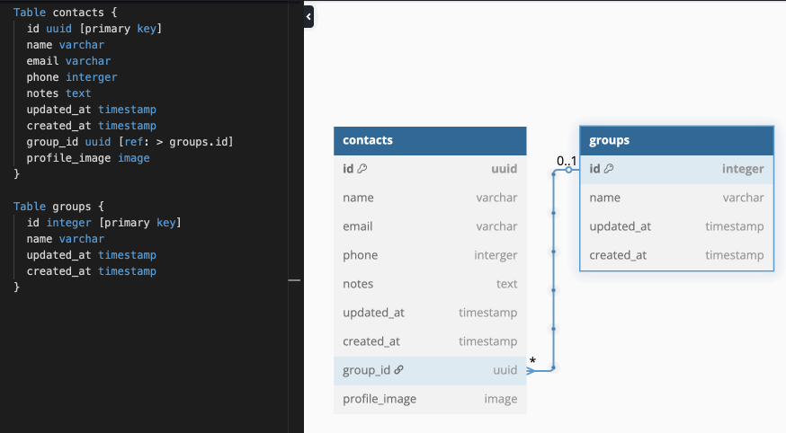

# 

## TABLE OF CONTENTS 
1. [OBJECTIVES](#objectives)
2. [PREREQUISITES](#prerequisites)
3. [DEMO](#demo)
4. [SETUP INSTRUCTIONS](#setup)
5. [MY JOURNEY](#journey)
6. [NICE TO HAVES](#nice)
7. [SPIKE DOC](#spike)

## OBJECTIVES 
Creating a contact list application.

## PREREQUISITES 
- [ ] React
- [ ] psql

## DEMO 

## SETUP INSTRUCTIONS 
How to run this: 
1. Clone this project by using `git clone https://github.com/wk642/contact-list-app.git`  
2. Install the packages `npm install`
3. Run this `npm run dev`

To create the database and tables and add the mock data, run this:
`npm run loadDB`

## MY JOURNEY 
- [x] create issues in repo as like a todo
- [x] create database diagram
- [x] Things to install:
  - [x] cors
  - [x] express
  - [x] concurrently
  - [x] nodemon
  - [x] npm
  - [x] tailwind
  - [x] pg-promise
  - [x] radix

- [x] create database and tables

## NICE TO HAVES 
- [ ] create a scroll bar with alphabets.
- [ ] have a button to scroll all the way back up.
- [ ] add localstorage or session storage so that the emoojis don't change when refreshed
- [ ] allow users to select their own contact image
## SPIKE DOC 
- [ ] research how to add local or session storage
